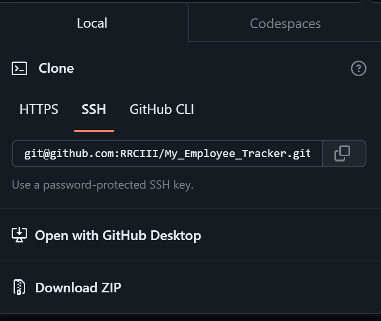
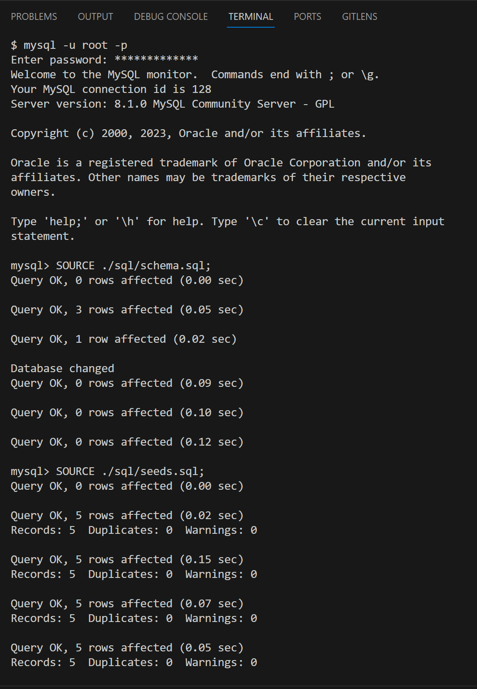
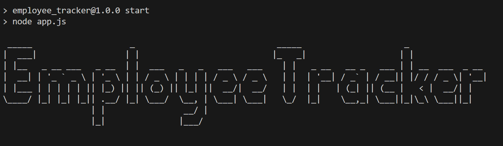
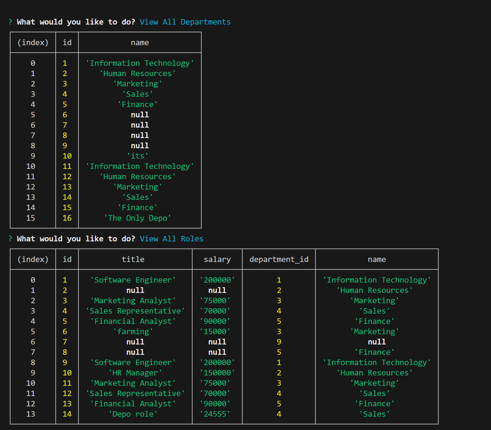

# Employee Tracker • [](https://opensource.org/licenses/MIT)

## Description

Node.js content management systems application that views and manages employees in a company, by interacting with a database from the command line, using MySQL and Inquirer.js.

## Video Demonstration of Application

- [Click Here]()

## Installation

- Required: LTS or latest version of Node.js
- Required: LTS or latest version of MySQL
- Required: (dotenv).config() for .env commmunication

## Usage

- #### Clone the repository



- #### Open up a terminal and change directories into the repo. Type in:

```
npm install
```

- #### Start MySQL server and execute both schema.sql & seeds.sql files within the ./sql folder. From the same path, type:

```
mysql -u root (-p for PASSWORD)
SOURCE ./sql/schema.sql;
SOURCE ./sql/seeds.sql;
```



- #### Start the application from the terminal with:

```
npm run start
```



<br>



## Credits

- UNC bootcamp collegues, Youtube, and chatGPT

## License

This application is covered under the [MIT License](./LICENSE)
